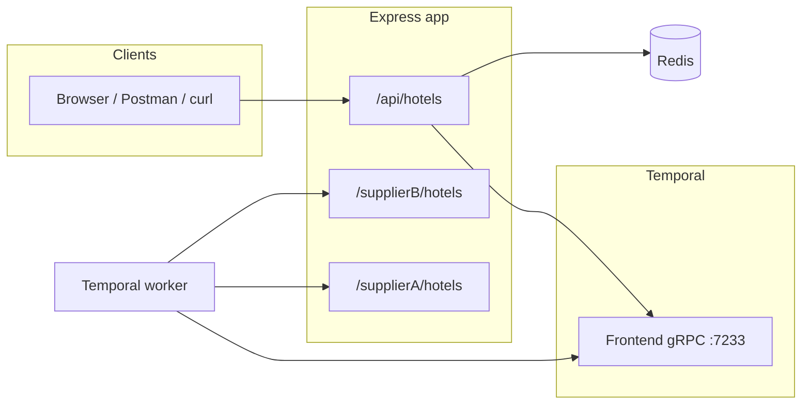

# Hotel Offer Orchestrator

Express service that merges hotel offers from two mock suppliers using a **Temporal** workflow (lowest price wins when the same hotel name appears from both suppliers), then stores results in **Redis** for optional price-range reads.

**Stack:** Node.js · Express · Temporal · Redis · PostgreSQL (Temporal persistence only) · Docker Compose

---

## Contents

- [How it fits together](#how-it-fits-together)
- [Ports and Temporal](#ports-and-temporal)
- [Prerequisites](#prerequisites)
- [Environment variables](#environment-variables)
- [Local development](#local-development)
- [Run everything in Docker](#run-everything-in-docker)
- [Scripts](#scripts)
- [HTTP API](#http-api)
- [Project layout](#project-layout)
- [Troubleshooting](#troubleshooting)

---

## How it fits together

1. A client calls **`GET /api/hotels?city=...`** on the Express app.
2. The route uses the **Temporal client** to run `hotelWorkflow` on task queue **`hotel-queue`**, with workflow id **`hotel-<city>`**.
3. A **Temporal worker** (separate process) runs the workflow and **activities** that `GET` supplier JSON from **`SUPPLIER_BASE_URL`** (by default the same Express app: `/supplierA/hotels` and `/supplierB/hotels`).
4. The workflow merges and dedupes; the API writes the outcome to **Redis** and returns JSON (optionally filtered by `minPrice` / `maxPrice` via Redis).



---

## Ports and Temporal

| Port | Service | What it is |
|------|---------|------------|
| **3000** | Express | HTTP API |
| **7233** | Temporal Frontend | **gRPC** endpoint for the Temporal SDK (workers + workflow client). Not opened in a browser. |
| **8080** | Temporal UI | **Web** dashboard to inspect workflows, histories, and task queues ([http://localhost:8080](http://localhost:8080)). |
| **6379** | Redis | Dedupe / price-filter cache |
| **5432** | PostgreSQL | Temporal server persistence (dev credentials in `docker-compose.yml`) |

---

## Prerequisites

- **Node.js** 22.x (same major as `Dockerfile`) or another version that runs the build cleanly
- **npm** 10+
- **Docker** with Compose v2 (`docker compose`) for Temporal, Postgres, Redis, and optional full-stack containers

---

## Environment variables

| Variable | Default | Used by | Description |
|----------|---------|---------|-------------|
| `TEMPORAL_ADDRESS` | `localhost:7233` | API, worker | Temporal Frontend address `host:port` (gRPC) |
| `REDIS_HOST` | `localhost` | API | Redis host |
| `REDIS_PORT` | `6379` | API | Redis port |
| `SUPPLIER_BASE_URL` | `http://localhost:3000` | Worker | Base URL for activity HTTP calls to supplier routes |

Set variables in your shell, IDE run configuration, or Compose `environment` blocks. The project depends on `dotenv` but **does not** call `dotenv.config()` in application code; add that yourself if you want a `.env` file loaded automatically.

---

## Local development

Run infrastructure in Docker and the Node processes on the host (good for editing with hot reload on the API).

### 1. Install

```bash
npm install
```

### 2. Start Postgres, Temporal, Temporal UI, and Redis

```bash
docker compose up -d postgresql temporal temporal-ui redis
```

Give Temporal **30–60 seconds** on first boot while Postgres and schema settle. Open [http://localhost:8080](http://localhost:8080) to confirm the UI loads.

### 3. API (terminal one)

```bash
npm run dev
```

Listens on [http://localhost:3000](http://localhost:3000) with reload on save.

### 4. Worker (terminal two)

The worker must be running or `/api/hotels` will hang or fail waiting for the task queue.

```bash
npm run build
npm run worker
```

After you change **workflow, activities, or worker** code, run **`npm run build` again** and restart the worker (`tsx watch` is not wired for the worker in `package.json`).

### 5. Smoke test

```bash
curl -s "http://localhost:3000/health" | jq .
curl -s "http://localhost:3000/api/hotels?city=delhi" | jq .
```

Postman: import `postman/Hotel-Offer-Orchestrator.postman_collection.json`.

---

## Run everything in Docker

Builds the app image twice as services **`app`** (API) and **`worker`**:

```bash
docker compose up --build -d
```

| Compose service | Role |
|-----------------|------|
| `postgresql` | Temporal persistence |
| `temporal` | Temporal server (`TEMPORAL_ADDRESS` → `temporal:7233` inside the network) |
| `temporal-ui` | Web UI on port 8080 |
| `redis` | Redis for the API |
| `app` | `npm start` — Express on 3000 |
| `worker` | `npm run worker` — `SUPPLIER_BASE_URL=http://app:3000` |

Stop and remove containers:

```bash
docker compose down
```

### Before production

- Change Postgres credentials and limit exposure; use TLS and auth for Redis and Temporal in real environments.
- Run **one or more workers** wherever they can reach `TEMPORAL_ADDRESS`; scale workers for throughput.
- Set `SUPPLIER_BASE_URL` to wherever supplier HTTP routes actually live (here they are the same app).
- Push a built image if you use a registry: `docker build -t hotel-offer-orchestrator:latest .`

---

## Scripts

| Command | Description |
|---------|-------------|
| `npm run dev` | API with `tsx watch` (TypeScript, no separate `build`) |
| `npm run build` | Emit `dist/` (required for `npm start` and `npm run worker`) |
| `npm start` | Production API: `node dist/server.js` |
| `npm run worker` | Worker: `node dist/temporal/worker.js` |

---

## HTTP API

| Method | Path | Notes |
|--------|------|--------|
| `GET` | `/health` | `200` if both supplier probes succeed, `503` if degraded |
| `GET` | `/supplierA/hotels?city=` | Mock data; **`city` required** |
| `GET` | `/supplierB/hotels?city=` | Mock data; **`city` required** |
| `GET` | `/api/hotels?city=` | Temporal merge + Redis persist; optional **`minPrice`**, **`maxPrice`** (invalid range → `400`) |

Example with price filter:

```bash
curl -s "http://localhost:3000/api/hotels?city=delhi&minPrice=100&maxPrice=500"
```

---

## Project layout

| Path | Purpose |
|------|---------|
| `src/server.ts` | HTTP server entry |
| `src/app.ts` | Express app, `/health`, supplier routes |
| `src/routes/hotelRoutes.ts` | `/api/hotels` |
| `src/temporal/` | Client, worker, `hotelWorkflow`, activities |
| `src/redis/` | Redis client, dedupe / price filter helpers |
| `src/suppliers/` | Static supplier catalogs, health probes |
| `docker-compose.yml` | Full local stack |
| `Dockerfile` | Node 22 slim, `npm ci`, `npm run build`, default command is the API |

---

## Troubleshooting

| Symptom | Likely cause | What to try |
|---------|----------------|------------|
| `/api/hotels` times out or errors | Worker not running or not connected to Temporal | Start `npm run worker` after `npm run build`; check `TEMPORAL_ADDRESS` matches your Temporal container |
| Temporal UI blank or errors right after `compose up` | Server still starting | Wait, then refresh; check `docker compose logs temporal` |
| `address already in use` on 3000 / 6379 / 7233 / 5432 | Port clash with another project | Stop the other service or change host ports in `docker-compose.yml` |
| Supplier health `503` | Probe uses city `delhi`; upstream returned non-200 or non-array | Hit `/supplierA/hotels?city=delhi` directly |
| Code changes in workflow not reflected | Worker uses compiled `dist/` | `npm run build` and restart the worker |
